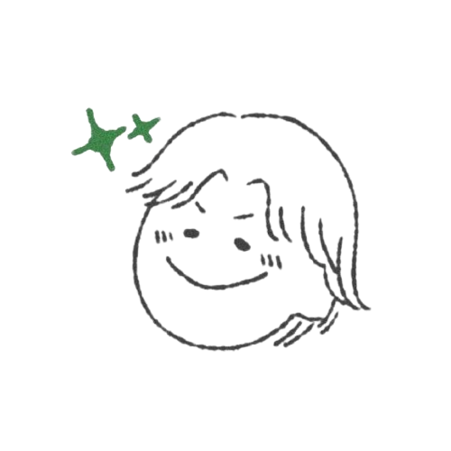

<a name="readme-top"/>

<br/>

<br />
<div align="center">
  <a href="https://github.com/zyx-0314/">
  <!-- TODO: If you want to add logo or banner you can add it here -->
    
  </a>
<!-- TODO: Change Title to the name of the title of your Project -->
  <h3 align="center">FINALS</h3>
</div>
<!-- TODO: Make a short description -->
<div align="center">

</div>

<br />

<!-- TODO: Change the zyx-0314 into your github username  -->
<!-- TODO: Change the WD-Template-Project into the same name of your folder -->


---

<br />
<br />

<!-- TODO: If you want to add more layers for your readme -->
<details>
  <summary>Table of Contents</summary>
  <ol>
    <li>
      <a href="#overview">Overview</a>
      <ol>
        <li>
          <a href="#key-components">Key Components</a>
        </li>
        <li>
          <a href="#technology">Technology</a>
        </li>
      </ol>
    </li>
    <li>
      <a href="#rules-and-principles">Rules and Principles</a>
    </li>
    <li>
      <a href="#resources">Resources</a>
    </li>
  </ol>
</details>

---

## Overview

<!-- TODO: To be changed -->

Portfolio website minimum of five pages. Must show a new resume and showcasing the previous projects from the course. 

Guiding Question:
- Home page
- New Resume
- Showcasing projects
- About Website
- About me


### Key Components
<!-- TODO: List of Key Components -->

Responsive Design
Ensures the website is accessible and visually appealing on all devices, from desktops to mobile phones.

Interactive UI Elements
Dynamic content updates without page reloads using JavaScript and AJAX.
Forms with client-side validation to enhance user experience.

Home Page
Welcoming section with a brief introduction and overview of the portfolio.
Navigation links to different sections of the website.

New Resume
A modern, well-structured resume highlighting skills, experiences, and achievements.
Downloadable PDF version of the resume for easy access.

Showcasing Projects
Detailed portfolio of previous projects with images, descriptions, and links to live demos or repositories.
Categorized sections for easy navigation (e.g., web development, design, etc.).

About Website
Information about the website's purpose, design principles, and development process.
Insights into the motivation behind creating the portfolio.

About Me
A personal section introducing the individual, their background, interests, and professional journey.
Contact information and links to social media profiles for networking.
### Technology
<!-- TODO: List of Technology Used -->


## Rules and Principles
1. Always use ***WD-*** in the Title of the Project for the Subject
2. Do not rename any .html files; always use 'index.html' as the filename.
3. File Structure to follow

```
WD-finals
└─ assets
|   └─ css
|   |   └─ style.css
|   └─ js
|   |   └─ script.js
|   └─ img
|       └─ fileWith.jpeg/.jpg/.webp/.png
└─ pages
|  └─ about-me
|     └─ index.html
|     └─ assets
|        └─ css
|        |  └─ style.css
|        └─ js
|        |  └─ script.js
|        └─ img
|           └─ fileWith.jpeg/.jpg/.webp/.png
|  └─ resume
|     └─ index.html
|     └─ assets
|        └─ css
|        |  └─ style.css
|        └─ js
|        |  └─ script.js
|        └─ img
|           └─ fileWith.jpeg/.jpg/.webp/.png
|  └─ seatwork-1
|     └─ index.html
|     └─ assets
|        └─ css
|        |  └─ style.css
|        └─ js
|        |  └─ script.js
|        └─ img
|           └─ fileWith.jpeg/.jpg/.webp/.png
|  └─ showcase
|     └─ index.html
|     └─ assets
|        └─ css
|        |  └─ style.css
|        └─ js
|        |  └─ script.js
|        └─ img
|           └─ fileWith.jpeg/.jpg/.webp/.png
|  └─ works
|     └─ index.html
|     └─ assets
|        └─ css
|        |  └─ style.css
|        └─ js
|        |  └─ script.js
|        └─ img
|           └─ fileWith.jpeg/.jpg/.webp/.png
|
└─ index.html
└─ readme.md
```

## Resources

<!-- TODO: Add References -->
| Title | Purpose | Link |
|-|-|-|
| Design| BUTTON DESIGN| https://uiverse.io/MuhammadHasann/silent-lizard-44 |
| Design| CARD DESIGN| https://www.youtube.com/watch?v=iFC84AlLqac&list=LL&index=1&t=6s |
| Design| CARD DESIGN| https://uiverse.io/gharsh11032000/selfish-owl-57 |
| Design| CARD DESIGN| https://uiverse.io/arshshaikh06/hard-cobra-69|
| Design| BUTTON DESIGN| https://uiverse.io/MuhammadHasann/silent-lizard-44 |
| DESIGN| SLIDER | https://www.youtube.com/watch?v=mF9yOwlunWk&t=705s |
| DESIGN| FEATURE SECTION | https://www.youtube.com/watch?v=pFtxR-O78sY |

